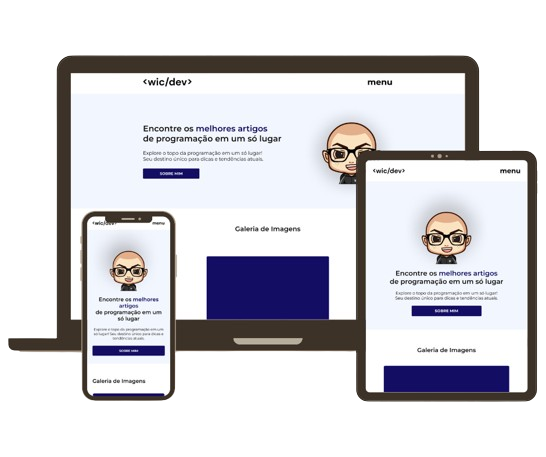

# **🌐 Code Explorer**

**Projeto criado com React e Next para o Desafio Code Explorer da Front End - Fusion**

**Desafios**

 ✔ 1. Página Inicial
 ✔ 2. Galeria de Imagens
 ✔ 3. Formulario de Contato
 ✔ 4. Menu Dropdown com Submenu
 ✔ 5. Responsividade 

## 🔗 Projeto:

[Deploy](***LINK-DO-PROJETO***)

[Figma](https://www.figma.com/design/JgRQIZ5Ea55xVbRJ58xu1F/Modelo?node-id=117-16)

## 💻 Tech Stack

- Next.Js 14
- React.Js
- TailwindCSS
- Figma
- GIT & Github

## ⭐ Contact

 
  
  
   

